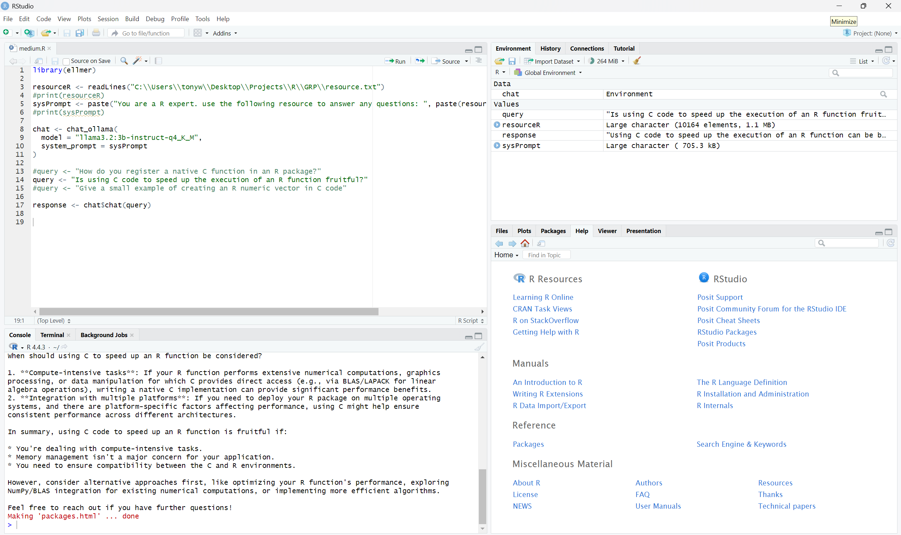

# Task: Medium

Using ellmer Package to Perform the Easy Task Programmatically

**In this task write-up, the ellmer R package is used to interact with the llama3.2:3b-instruct-q4_K_M model. This involves querying the model for specific R-related questions, similar to the manual query process done previously in the easy task.**




---

### Reading the "Writing R Extensions" (https://cran.r-project.org/doc/manuals/r-devel/R-exts.html) website
```r
resourceR <- readLines("resource.txt")
```
This reads the contents of the file which is the txt version of the documention from the "Writing R Extensions" (https://cran.r-project.org/doc/manuals/r-devel/R-exts.html) website

### Creating the System Prompt
```r
sysPrompt <- paste("You are a R expert. use the following resource to answer any questions: ", paste(resourceR, collapse = " "), sep = "")
```
This combines the contents of resourceR into a single string sysPrompt, with each line of the resource file being concatenated into one large string.

The string "You are a R expert. use the following resource to answer any questions: " is prepended to this string, giving the model context that it should behave as an expert using the provided resource.

### Initializing the Chat Session
```r
chat <- chat_ollama(
  model = "llama3.2:3b-instruct-q4_K_M",
  system_prompt = sysPrompt
)
```

The chat_ollama() function initializes a chat session with the specified model ("llama3.2:3b-instruct-q4_K_M") and provides it with a system_prompt.

The system_prompt argument sets the context for the model. In this case, it tells the model to act as an expert in R, using the contents of the resource.txt file as a reference to answer questions. The model will draw on this context when responding to queries.

**Question:**
```
"Is using C code to speed up the execution of an R function fruitful?"
```

### Output

<details>
  <summary><i>Response</i></summary>
  <br>
Using C code to speed up the execution of an R function can be beneficial in certain situations, but it's 
not always the best approach.

Here are some pros and cons to consider:

Pros:

1. **Native performance**: Writing a fast C function can result in native performance, which is 
particularly advantageous for compute-intensive tasks that don't involve interactive user input or memory 
allocation/maintenance.
2. **Control over memory management**: In R, memory management is handled at the language level. By 
writing a C function, you have direct control over how memory is allocated and deallocated, which can lead
to performance and safety improvements.
3. **Avoiding R's overhead**: Some parts of R, like error handling and debugging tools, introduce overhead
that might impact the performance of your code. By bypassing R's glue code and going straight to C, you 
can potentially avoid or minimize this overhead.

Cons:

1. **C interface complexity**: Writing a C function that interfaces with R requires creating a suitable C 
wrapper around the R functions you want to call from C. This can add complexity to your project and make 
maintenance harder.
2. **Memory leaks and segmentation faults**: If not managed properly, memory allocation and deallocation 
in C can lead to memory leaks or segmentation faults, which can be tricky to diagnose and fix.
3. **Inability to leverage R's package ecosystem**: Since you'll need to write a standalone C function, 
you won't benefit from the extensive package ecosystem that R provides for sharing functionality across 
packages.
4. **Compatibility issues**: Integrating your C code with R requires ensuring compatibility between the 
two systems. Any differences in how memory is allocated or accessed can lead to errors at runtime.

When should using C to speed up an R function be considered?

1. **Compute-intensive tasks**: If your R function performs extensive numerical computations, graphics 
processing, or data manipulation for which C provides direct access (e.g., via BLAS/LAPACK for linear 
algebra operations), writing a native C implementation can provide significant performance benefits.
2. **Integration with multiple platforms**: If you need to deploy your R package on multiple operating 
systems, and there are platform-specific factors affecting performance, using C might help ensure 
consistent performance across different architectures.

In summary, using C code to speed up an R function is fruitful if:

* You're dealing with compute-intensive tasks.
* Memory management isn't a major concern for your application.
* You need to ensure compatibility between the C and R environments.

However, consider alternative approaches first, like optimizing your R function's performance, exploring 
NumPy/BLAS integration for existing numerical computations, or implementing more efficient algorithms.

</details>