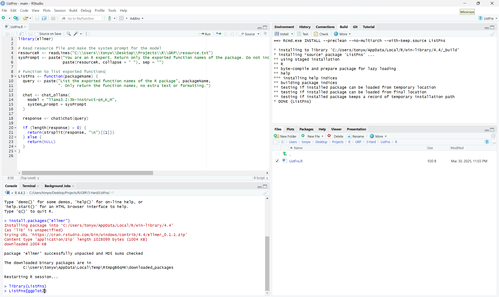
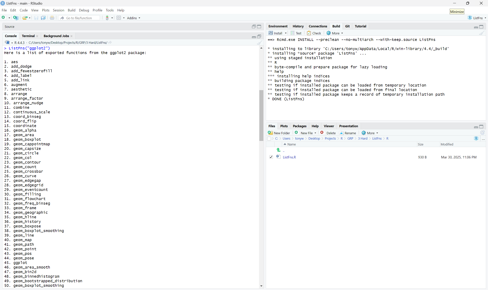

# Task: Hard

Create an R package that depends on ellmer and provides a function that takes the name of a package returns a character vector of functions exported by that package by only using ellmer and llama3.2:3b from Ollama

**In this task write-up, we create a R package that uses the ellmer R package to interact with the llama3.2:3b-instruct-q4_K_M model. This involves querying the model for specific R-related questions, similar to the manual query process done previously in the easy and medium task.**

